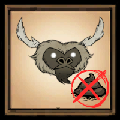

## Proudly Discontinued due to Official Adoption

*Beefalo no longer poop **while being ridden*** since [release 445759][update] on December 17 of 2020.

It's an honor that my little change is (in some way) accepted and done by Klei.

Have fun playing!

# Beefalo Tamed No Poop

This is a mod for Klei's game [Don't Starve Together][dst], it prevents **tamed** beefalo from pooping around.

> Note that if goes feral, it will start to drop manure again. But we don't let it go feral, do we? ;P

## How to Get This Mod

- Subscribe on [Steam][steam]
- Download from [Klei][klei]
- Download from [GitHub][github]

[update]: https://forums.kleientertainment.com/game-updates/dst/445759-r1389/ "445759 - Don't Starve Together - Klei Entertainment Forums"

[dst]: https://klei.com/games/dont-starve-together "Don't Starve Together | Klei Entertainment"

[steam]: https://steamcommunity.com/sharedfiles/filedetails/?id=1769805475 "Steam Workshop :: Beefalo Tamed No Poop"

[klei]: https://forums.kleientertainment.com/files/file/1948-beefalo-tamed-no-poop/ "Beefalo Tamed No Poop - Game Modifications - Klei Entertainment Forums"

[github]: https://github.com/liolok/BeefaloTamedNoPoop/releases "Releases · liolok/BeefaloTamedNoPoop"
